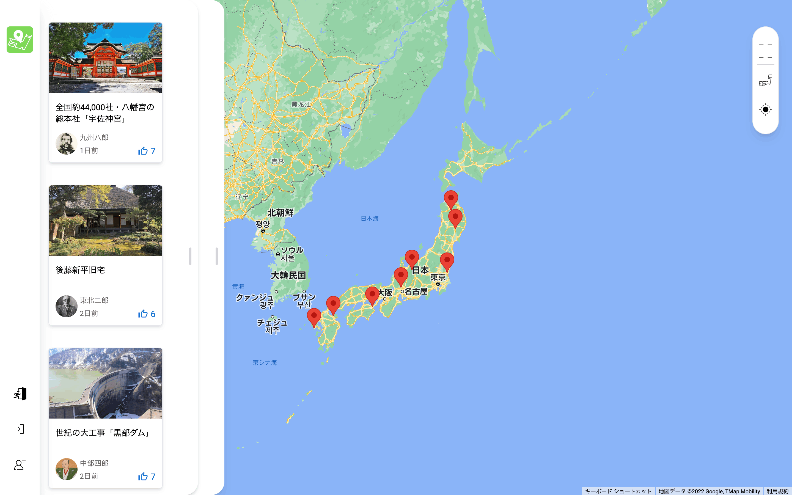
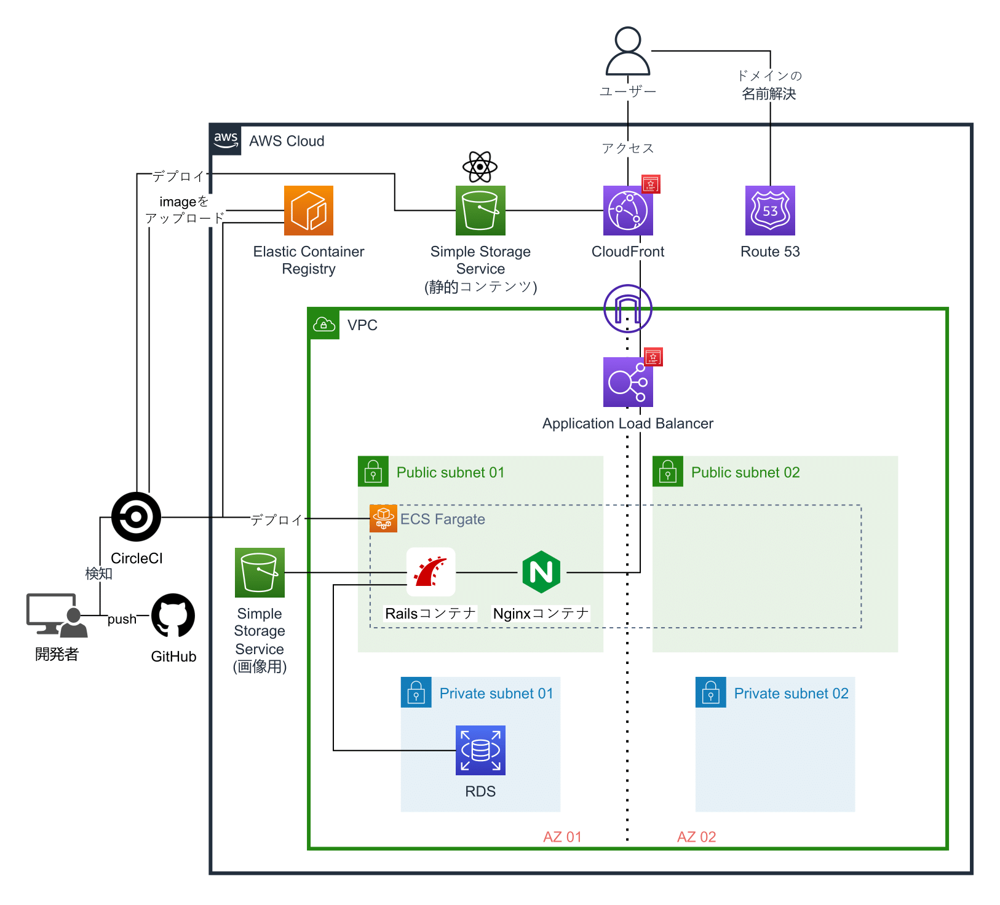
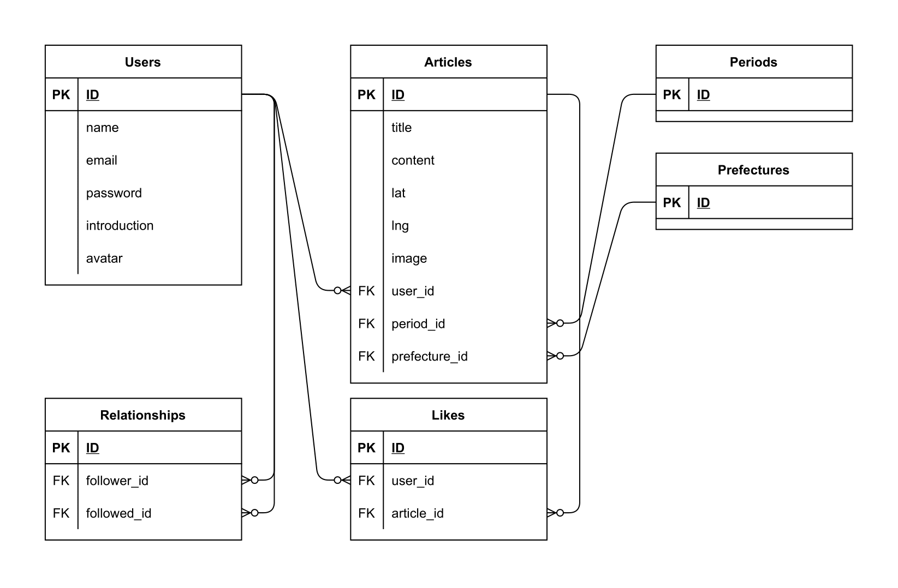

# 歴史地図
『歴史地図』は、Google Maps API を使用し、地図上に歴史的な出来事を投稿し、それを共有するサービスです。  
URL ： https://www.rekishichizu.jp

## 特徴

 
  
<h3>SPAアプリ</h3>

  このアプリはフロントエンドで Create React App を使い作成したSPAアプリを、AWS S3 へデプロイし AWS CloudFront で静的コンテンツとして配信しています。 
  また、SPAアプリの弱点である初期読み込みの遅さを解消する工夫として、初期読み込みする記事数を減らし、無限スクロールによってデータを追加取得することや、バックエンドの N+1 問題を解消することによってレスポンスを早くするなどの工夫を施しています。

 
  
<h3>CI / CD 環境</h3>

  開発環境に Docker を使用し、CI / CD ツールとして CircleCI を使用しています。 
  CircleCI が GitHub のmainブランチへのpush / mergeを検知して、自動でテストが走り、テストが成功すると自動デプロイが実行される環境を構築しています。 
  また、 git commit を実行した際に自動でコード解析、コード整形が行われ、コードの品質を一定に保つようになっています。

 
  
<h3>ECS Fargate 使用によるスケーラビリティ ・ ポータビリティ<h3>

  バックエンドのproduction環境として Fargate を使用することで、拡張が容易で、さらにコンテナ技術により開発環境とproduction環境の差異を吸収し、携帯性の高い環境を構築しています。

 
  
<h3>Google Map + React</h3>

  このアプリのメイン機能である地図と記事の表示や扱いについて、Google Maps API と React の豊富なライブラリを活用し、なるべくユーザーが分かりやすく簡単に操作できるようにアプリを作成しました。

 

 
  
TypeScript

  TypeScript により、安全性の高い JavaScript コードとなっています。

 

 
  
RESTful API

  厳密には RESTful API とは呼べないかもしれませんが、なるべく RESTful API の原則にのっとった仕様を目指しました。 
  例) 
  &emsp;・ Devise Token Auth を使用したトークン認証によりステートレスな設計 
  &emsp;・ リソース検索 : [GET]&emsp;&emsp;https&#58;//api.rekishichizu.jp/v1/articles?ids=9,35,37&words=神社&period_ids=5,6&sort_by=likes_count+DESC 
  &emsp;・ 個別リソース : [GET]&emsp;&emsp;https&#58;//api.rekishichizu.jp/v1/users/{user_name} 
  &emsp;・ リソース削除 : [DELETE] https&#58;//api.rekishichizu.jp/v1/articles/{article_id} *ヘッダーに認証トークンが必要

 

 
  
フロントエンドのディレクトリ構成

  フロントエンドのディレクトリ構成でUIとロジックの切り分けを意識し、また、UIについてもレイアウトと要素の切り分けなどを意識したディレクトリ構成にしました(一部切り分けが終わっていないコードがあります。また下記の定義を厳密に守っているわけではありません)。 
  src/ 
  ├ Hooks&emsp;&emsp; (カスタムフック) 
  ├ Utils&emsp;&emsp;&emsp;(ロジック関連) 
  ├ Pages&emsp;&emsp; (URLに対応。Viewで構成される。ページ全体のレイアウトを決定する) 
  ├ Views&emsp;&emsp; (TemplateとPartで構成され、主に要素間のスペースなどのレイアウトを決定する) 
  ├ Templates (Partで構成される) 
  ├ Parts&emsp;&emsp;&ensp;(最小UI要素。自身で完結したロジックのみ持つ) 
  └ index.tsx

 

 
  
扱いやすい検索機能

  Ruby の Gem Ransack を使用し、記事のタイトル、説明、またはユーザー名に対する部分一致検索、これら条件にプラスしてソート検索やタグ検索を併用して検索できます。 
  また、デモデータを各都道府県に最低1つずつ用意し、様々な条件で検索を試すことができるようにしました。

 

 
  
フォロー・イイね機能

  多対多のデータ構造を中間テーブルを使い表現しています。

 
 

##  AWS構成図

##  ER図

##  使用技術
### フロントエンド
- HTML / CSS
- TypeScript v4.7.4
- React (Create React App) v18.2.0  
  - MUI v5.10.11
  - React Router v6.4.2
- Google Maps API
  - Maps Javascript API
  - Geocoding API
- TailwindCSS v3.1.6
- ESLint / Prettier (コード解析)
- husky
### バックエンド
- Ruby v3.1.2
  - Rails (APIモード) v7.0.3.1
  - Devise / Devise Token Auth (ログイン認証)
  - Ransack (検索)
  - Unicorn (APPサーバ)
  - Rspec (テスト)
  - Rubocop (コード解析)
- MySQL v8.0.29
- Nginx
### インフラ ・ 開発環境
- AWS
  - ECS Fargate
  - ECR
  - RDS
  - S3
  - CloudFront
  - ALB
  - Route53
  - ACM
  - Systems Manager
  - CloudWatch
- CircleCI
- Docker / Docker-compose
- Git / GitHub

##  機能一覧
### マップ関連
- 現在地取得 (Geocoding API)
- フルスクリーン切り替え
- 地図全体表示ショートカットボタン
- クリックした座標取得 (Geocoding API)
- クリックした座標から自動で都道府県選択
- マップ上にピン表示
- 記事クリックでピンに注目
- ピンをホバーでイメージ画像表示
- ロード中にサーキュラーインジケーター表示
### 記事関連
- 無限スクロール (React Infinite Scroller、 Kaminari)
- タイトル・説明・ユーザー名の部分一致検索 (Ransack)
- 時代、都道府県タグによる検索 (Ransack)
- ソート検索 (Ransack)
- 検索結果を地図上に表示
- モーダル (MUI)
- 画像スライド (Swiper)
- 〇〇日前 表示 (timeago-react)
- イイね機能
- 記事削除
- ロード中にスケルトンスクリーン表示
### ユーザー関連
- CRUD (Devise)
- インライン編集
- ログイン関連 (Devise Token Auth)
- 簡単ログイン
- フォロー機能

##  製作の背景
私はここ数年で歴史に興味を持ち始めたのですが、歴史を知ると普段気に止めなかった日常の中に、実は歴史に関連したものがたくさんあることに気が付きました。

しかし、そういった歴史的なものを地理と絡めて総合的に見れるサイトはなく、私が身の回りの歴史的なものに気付けたきっかけも、Wikipediaの記事でたまたま発見できたからでした。そういった特定のソースからしかアクセスできないという状態を解消するために、地図上で視覚的に歴史的出来事を総合的に見れるサイトを作ろうと思いました。

このサービスを使うとそれまで知らなかった身の周りにある歴史的なものに気付けるのはもちろんのこと、例えば旅先など出先でその土地について調べてみると、思わぬ発見があるかも知れません。実際、私もこのアプリのサンプルデータの作成過程で、以前訪れたことがある土地に思わぬ発見があり、少し寄り道をして訪れればよかったと後悔したことが何度かありました。

## 改良予定
1. フロントエンドのテスト作成
1. ユーザー削除機能
1. IaC Terraform 導入
1. ユーザーがタグを作成・検索できる機能
1. 記事編集機能
1. レスポンシブUI対応
1. Wikipedia API導入
1. OAuth導入
